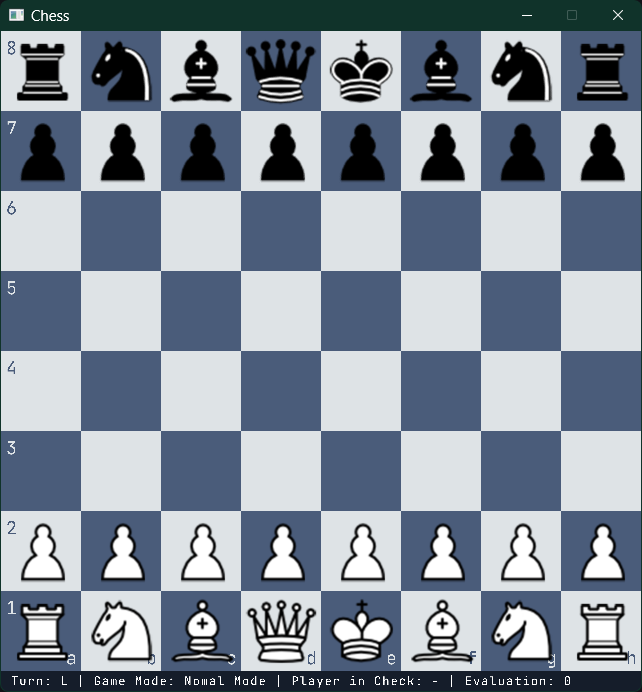

# SeaChess

SeaChess is a chess engine written in C++23.

The project is focused on the implementation of a chess engine from the ground up, with particular attention to board representation, move generation, search, hashing, and performance.



## Features

- 64-bit bitboard board representation
- Precomputed pawn, knight, and king attack tables
- Magic bitboards for bishop and rook attacks
- Legal move generation
- Castling
- En passant
- Pawn promotion
- FEN parsing
- Make and unmake move support
- Zobrist hashing
- Negamax with alpha-beta pruning
- Transposition table
- Move ordering
- Piece-square evaluation
- UCI interface
- Perft support

## Architecture

The engine is split into a reusable core and separate frontends.

```text
chess_core
    Board
    Move generation
    Perft
    Zobrist hashing
    Search
    Transposition table

        |
        +----------------+
        |                |
    seachess_uci      seachess
      UCI CLI           GUI
```

The core does not depend on the GUI. This allows the same engine implementation to be used through the graphical application or through the UCI interface.

## Board Representation

SeaChess uses bitboards to represent piece positions.

Each piece type has its own 64-bit bitboard, with separate occupancy bitboards for each side and the complete board.

Sliding piece attacks use magic bitboards with precomputed lookup tables.

```text
Board
 ├── Light pieces
 │   ├── Pawn
 │   ├── Knight
 │   ├── Bishop
 │   ├── Rook
 │   ├── Queen
 │   └── King
 │
 ├── Dark pieces
 │   ├── Pawn
 │   ├── Knight
 │   ├── Bishop
 │   ├── Rook
 │   ├── Queen
 │   └── King
 │
 └── Occupancy
```

## Move Generation

Move generation is separated into attack generation and game rules.

Non-sliding attacks are obtained from precomputed tables. Bishop and rook attacks use magic-bitboard lookup tables, while queen attacks combine the corresponding bishop and rook attacks.

Generated moves are then filtered for legality, including king safety and special moves.

## Search

The engine currently uses negamax with alpha-beta pruning.

A transposition table stores previously searched positions using Zobrist hashes. The search also uses the transposition table's best move for move ordering.

The evaluation function currently includes material and positional terms such as piece-square tables, mobility, bishop pair, king safety, and rook positioning.

## UCI

SeaChess includes a separate UCI executable.

Example:

```text
uci
isready
position startpos
go depth 8
```

This keeps the engine independent from the GUI and allows it to be used with UCI-compatible chess software.

## Perft

Perft is included for testing move generation against known chess positions.

Example:

```text
seachess_uci
```

The UCI executable can be used to run positions and inspect generated moves while developing the engine.

## Project Structure

```text
source/
├── core/
│   ├── board.cpp
│   ├── movegen.cpp
│   ├── perft.cpp
│   └── zobrist.cpp
│
├── engine/
│   ├── engine.cpp
│   └── tt.cpp
│
├── main_uci.cpp
├── main_gui.cpp
├── window.cpp
├── render.cpp
├── assets.cpp
└── game_state.cpp

dependencies/
└── raylib
```

The engine core is built as its own CMake library and is linked by both the UCI executable and the graphical application.

## Building

Requirements:

- C++23 compiler
- CMake 3.15 or newer
- Raylib

Build with CMake:

```bash
cmake -S . -B build
cmake --build build --config Release
```

This produces two applications:

```text
seachess
seachess_uci
```

`seachess` launches the graphical application.

`seachess_uci` runs the engine through the UCI interface.

## Current Focus

The project is still under active development.

The main areas I'm currently working on are:

- Improving search performance
- Improving move ordering
- Expanding the evaluation function
- Improving engine benchmarks
- Expanding perft and correctness testing
- Refining the UCI interface

## Why I Built It

SeaChess started as an attempt to understand how chess engines work by implementing the important components myself rather than relying on an existing chess library.

The project has since become a deeper exploration of bitboards, low-level data representation, search algorithms, hashing, and performance-oriented C++.